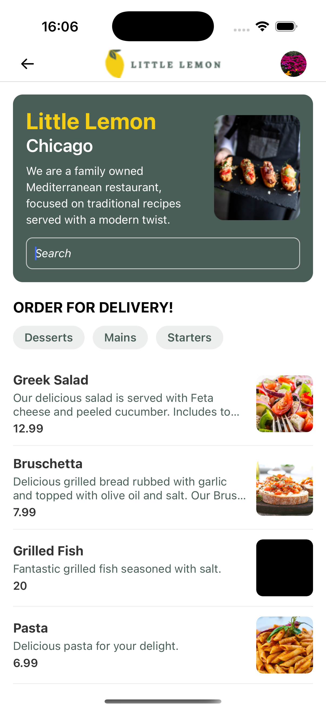
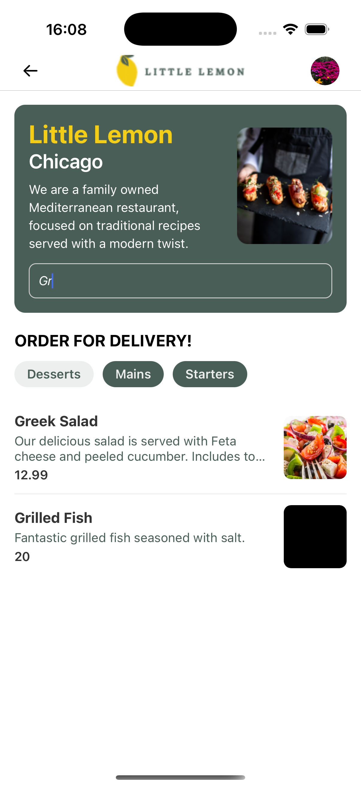
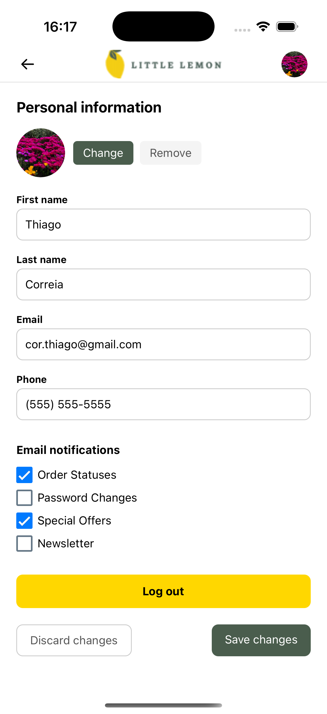

# Little Lemon Restaurant App

A React Native mobile application for Little Lemon, a family-owned Mediterranean restaurant in Chicago. This app allows customers to browse the menu, filter items, manage their profile. This is a final project assessment.

## Screenshots

<div align="center">
  <div style="display: inline-block; margin: 0 10px;">
    
    <p align="center"><em>Home Screen</em></p>
  </div>
  <div style="display: inline-block; margin: 0 10px;">
    
    <p align="center"><em>Filtered Menu</em></p>
  </div>
  <div style="display: inline-block; margin: 0 10px;">
    
    <p align="center"><em>Profile Screen</em></p>
  </div>
</div>

## Features

- **User Authentication & Profile Management**
  - Personal information storage
  - Avatar image upload
  - Preferences management
  - Email notifications settings

- **Menu Management**
  - Dynamic menu items loading
  - Category-based filtering (Starters, Mains, Desserts)
  - Search functionality
  - Real-time menu updates

- **UI/UX**
  - Clean and intuitive interface
  - Responsive design
  - Custom navigation header
  - Profile picture with initials fallback

## Technologies Used

- React Native with Expo
- @react-navigation for screen navigation
- AsyncStorage for local data persistence
- SQLite for menu items database
- Expo Image Picker for avatar management
- React Native Mask Text for input formatting

## Installation

1. Clone the repository:
```bash
git clone git@github.com:corthiago/little-lemon.git
```

2. Install dependencies:
```bash
cd little-lemon
npm install
```

3. Start the Expo development server:
```bash
npm start
```

4. Run on iOS or Android:
```bash
Press a │ open Android
# or
Press i │ open iOS simulator
```

## Data Storage

- **AsyncStorage**: Used for user profile and preferences
- **SQLite**: Stores menu items and categories
- **API Integration**: Fetches menu data from remote server


## Database Schema

The app uses SQLite with the following main table:

```sql
CREATE TABLE menu (
  id INTEGER PRIMARY KEY AUTOINCREMENT,
  name TEXT,
  description TEXT,
  price TEXT,
  image TEXT,
  category TEXT
);
```

## Project Structure

```
little-lemon/
├── assets/
├── components/
│   ├── Avatar.js
│   ├── Check.js
│   ├── Header.js
│   ├── Filters.js
│   ├── InputPhone.js
│   ├── InputText.js
│   └── MenuItem.js
├── screens/
│   ├── Home.js
│   ├── Profile.js
│   └── Onboarding.js
│   └── Splash.js
├── utils/
│   ├── database.js
│   └── storage.js
│   └── api.js
│   └── validation.js
│   └── utils.js
└── App.js
```

## Contributing

1. Fork the repository
2. Create your feature branch
3. Commit your changes
4. Push to the branch
5. Create a new Pull Request

## License

This project is licensed under the MIT License - see the LICENSE file for details.